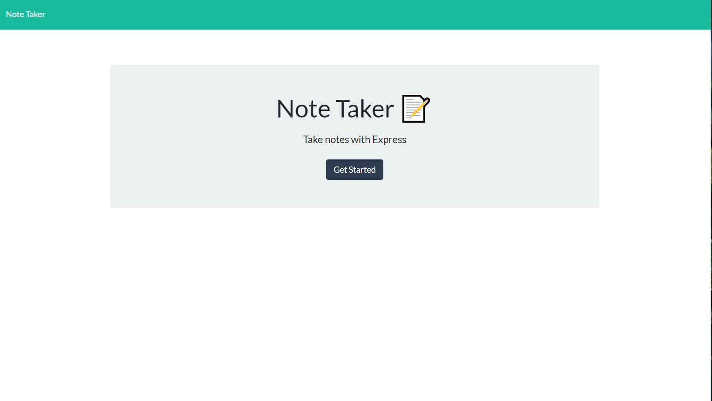
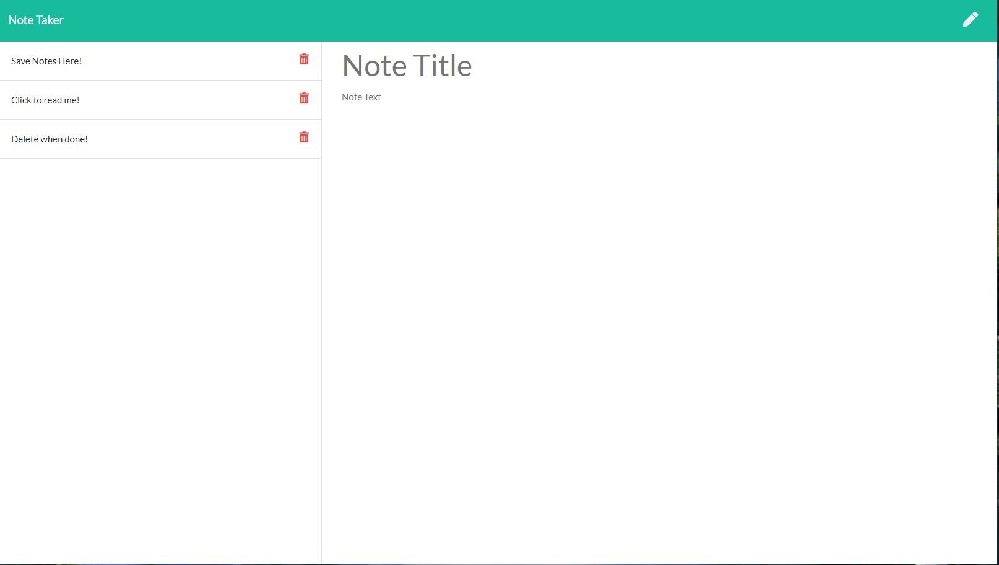

# Express Note Taker

## Description

A simple web app for taking notes, storing to-do lists, or just setting reminders for yourself.

## Table of contents

- [Description](#Description)
- [Installation](#Installation)
- [Usage](#Usage)
- [License](#License)
- [Technologies](#Technologies)
- [Contribution](#Contribution)
- [Tests](#Tests)
- [Questions](#Questions)

## Installation

In the project directory, "npm i" will install necessary depencies for development.

## Usage

Navigate to the URL https://note-taker-to-the-max.herokuapp.com to get started!

## License

# Technologies

HTML,JavaScript,node.JS

## Contribution

None

## Tests

None

## Questions

siegelal@protonmail.com [Github page](https://www.github.com/siegelal7)
